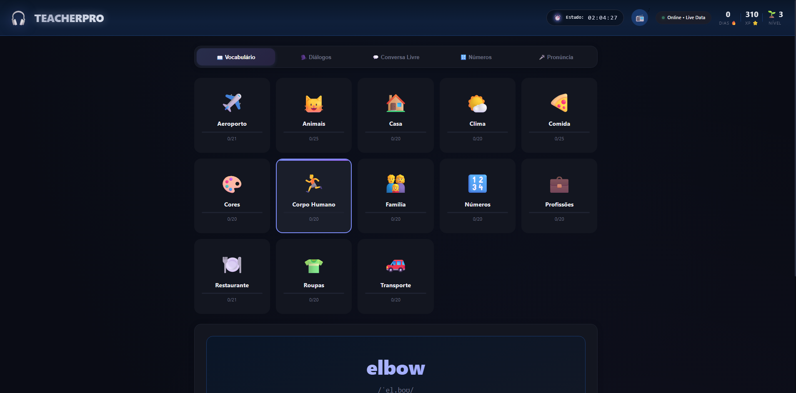
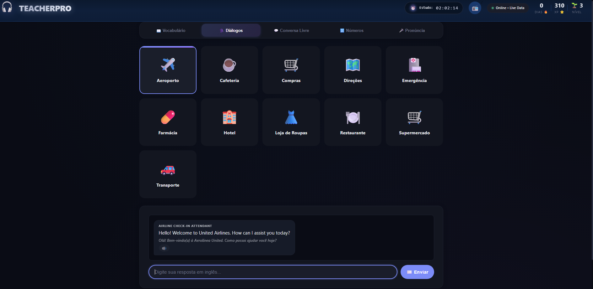
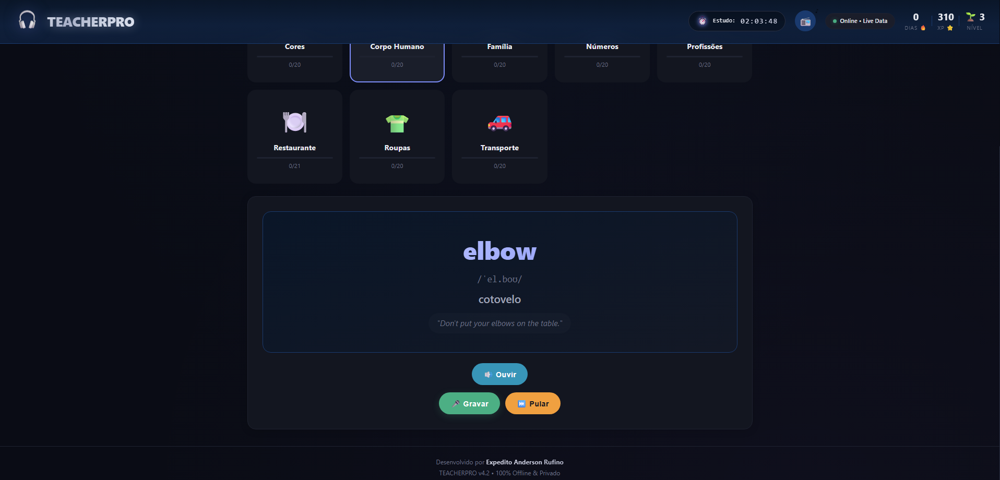
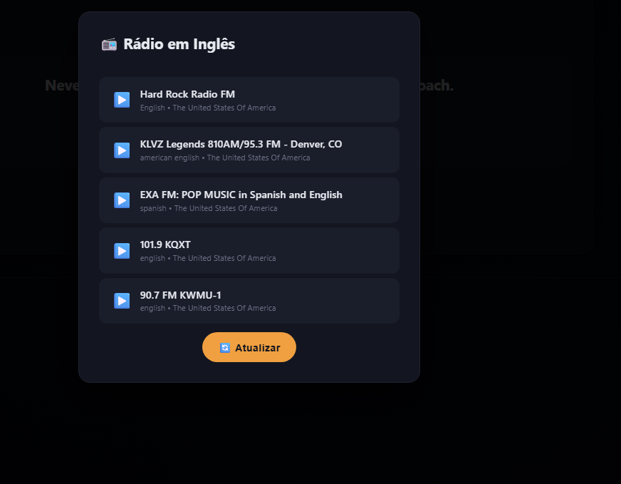

 # 🎧 TEACHERPRO v4.2 — AI-Powered English Tutor (Offline & Hybrid)

> **An AI Education Technology Asset Ready for Acquisition**

---

## 📌 Executive Summary

**TEACHERPRO** is a complete, production‑ready English tutor that integrates **four AI models** and operates **100% offline** on the user’s device. Designed for schools, businesses, and EdTech companies, it delivers real‑time pronunciation analysis, interactive dialogues, free‑form conversation, and gamified progress tracking — without ever sending voice or personal data to the cloud.

The software is **registered with the Brazilian INPI** (intellectual property office), comes with **full source code, professional installer, documentation, and security audit**, and is available for **outright acquisition or licensing**. This is not a prototype — it is a mature asset that can be rebranded, expanded, or integrated immediately.

---

## 🌐 Links

- **Website:** [softwareforsaleteacherpro.carrd.co](https://softwareforsaleteacherpro.carrd.co/)
- **Product Demo:** [Watch on YouTube](https://youtu.be/ZR_pklHKgB4)
- **GitHub Repository:** [github.com/eartnet09-boop/Teacherpro](https://github.com/eartnet09-boop/Teacherpro)
- **Documentation:** [docs/](docs/)
- **Contact:** [expeditoanderson08@gmail.com](mailto:expeditoanderson08@gmail.com)

---

## 🎯 Why Acquire TEACHERPRO?

| Benefit | Description |
|:---|:---|
| ⏱️ **Zero Time‑to‑Market** | Already built, tested, and packaged. Start commercialising tomorrow. |
| 💰 **Massive Cost Savings** | Developing a comparable AI language platform from scratch would require a multi‑specialist team and significant capital. |
| 🧠 **Proven AI Pipeline** | Four state‑of‑the‑art models (Whisper, WavLM, Wav2Vec2, Qwen 2.5) integrated into a single seamless workflow. |
| 🔒 **Full Privacy & Offline Operation** | All data stays on the user’s machine — LGPD/GDPR compliant by design. |
| 📦 **Complete Package** | Source code, installer, database, documentation, security report, and transferable IP rights. |
| 🏛️ **Legally Protected** | Software registration with Brazil's INPI guarantees original authorship and facilitates IP transfer. |

---

## 🖼️ Screenshots

### Main Dashboard

### AI Conversation

### Pronunciation Analysis

### Gamification & Progress

### radio in english

---

## 🚀 Key Features

- 📖 **Vocabulary** — 260+ words across 13 categories with pronunciation, translation, and scoring.
- 🎤 **Pronunciation Analysis** — Professional audio pipeline with noise reduction, LUFS normalisation, and forced alignment.
- 🗣️ **AI Dialogues** — Realistic role‑plays (waiter, receptionist, doctor) powered by Qwen 2.5.
- 💬 **Free Conversation** — Open chat with an AI tutor that corrects mistakes and explains grammar.
- 🔢 **Numbers** — Cardinal, ordinal, time, prices, and measurements.
- 📻 **English Radio** — Optional live streaming from US/UK stations.
- 🏆 **Gamification** — XP, levels, achievements, and spaced repetition (SRS).
- 🌐 **Hybrid Mode** — Works 100% offline; optional online enrichment (weather, culture) without exposing user data.

---

## 🧠 AI Pipeline
Microphone → Audio Processing → Speech Recognition → Acoustic Analysis → Forced Alignment → AI Tutor → Gamification → Student Feedback

text

Four models work together to turn raw speech into personalised feedback:

| Stage | Model | Provider |
|:---|:---|:---|
| Speech‑to‑Text | Whisper Tiny | OpenAI |
| Phonetic Embeddings | WavLM Base+ | Microsoft |
| Temporal Alignment | Wav2Vec2 Base | Meta |
| Conversational AI | Qwen 2.5‑Coder 3B | Alibaba |

All models run **locally** (via Ollama) — no cloud GPU costs, no data leaks.

---

## 🏗️ Architecture & Stack

### High‑Level Architecture
User Browser (localhost:8000) → FastAPI (app.py)
├── Audio Processor (noisereduce, pyloudnorm)
├── Whisper (transcription)
├── WavLM + Wav2Vec2 (pronunciation)
├── Qwen 2.5 (tutor)
├── SQLite (progress, gamification)
└── Context Engine (optional online APIs)

text

### Technology Stack

| Layer | Technology |
|:---|:---|
| **Backend** | Python 3.11, FastAPI, Uvicorn, Ollama |
| **Frontend** | Vanilla JavaScript, HTML5, CSS3 (no heavy frameworks) |
| **Database** | SQLite (WAL mode, Repository Pattern) |
| **AI / ML** | PyTorch, Hugging Face Transformers, Whisper, Torchaudio |
| **Audio Processing** | librosa, noisereduce, pyloudnorm, pydub |
| **Text‑to‑Speech** | gTTS / Edge TTS (local cache for offline) |
| **Packaging** | PyInstaller, Inno Setup (professional installer) |
| **Code Protection** | PyArmor, digital signature (signtool) |

---

## ✅ Automated Tests — 47/47 Passed

The project includes **47 automated tests** covering:

- API endpoints (health, categories, dialogs, progress, error handling)
- Business logic (spaced repetition, gamification, XP calculation)
- AI tutor (mock‑based fallback tests)
- Pronunciation scorer (cosine similarity, classification, edge cases)

Run with `pytest tests/ -v`. All tests pass when the server is running (see documentation).

---

## 🛡️ Security & Intellectual Property

- **Bandit Security Audit** — Full static‑analysis report available in `docs/security/`. No high‑severity vulnerabilities found.
- **Code Obfuscation** — PyArmor protects the distributed binaries.
- **Digital Signature** — Executable signed for Windows trust.
- **INPI Registration** — Brazilian National Institute of Industrial Property  
  **Registration Number:** `BR 51 2026 003960 6`  
  This registration protects the software’s copyright and proves original authorship. The rights are **transferable** to the acquirer.

> **Note on the name TEACHERPRO:** The mark "TEACHERPRO" is used as a suggestive name for the product. The INPI registration covers the software itself, not a trademark. If the buyer wishes to obtain exclusive rights over the name, a separate trademark application is recommended.

---

## 💼 Business Models

This asset can be commercialised in multiple ways:

- 🏷️ **White‑Label** — Rebrand and sell as your own product.
- ☁️ **SaaS** — Offer monthly/annual subscriptions with cloud sync (optional).
- 💻 **Desktop App** — Sell perpetual licences or one‑time purchases.
- 🏫 **School Licensing** — Per‑student or per‑campus pricing.
- 🏢 **Corporate Training** — English upskilling for employees (T&D).
- 🏛️ **Government Education Programs** — Large‑scale deployment in public schools.
- 📚 **Educational Franchise** — Bundle with other courses and materials.

---

## 📦 What’s Included in the Acquisition

| Item | Status |
|:---|:---|
| Full source code (Python / Vanilla JS) | ✅ |
| Windows executable (.exe) | ✅ |
| Professional installer (Inno Setup) | ✅ |
| Pre‑populated database (260+ words, 80+ dialogs, 18 achievements) | ✅ |
| Architecture documentation | ✅ |
| Security audit report (Bandit) | ✅ |
| INPI registration (transferable) | ✅ |
| Integrated AI pipeline | ✅ |
| Gamification system with SRS | ✅ |

---

## 🗺️ Roadmap (Post‑Acquisition Suggestions)

- Add more languages (Spanish, French, Mandarin)
- Build a SaaS version with user accounts and cloud sync
- Integrate with LMS platforms (Moodle, Canvas)
- Develop a mobile companion app
- Add speech‑to‑text for dictation exercises
- Create a teacher dashboard for classroom management

These are opportunities the new owner can explore to increase the asset’s value.

---

## 📄 Documentation

- [Technical Specification](docs/SPECIFICATION.md)
- [Architecture](docs/architecture.md)
- [Security Report (Bandit)](docs/security/bandit_report.html)
- [Business Overview](docs/business.md)

---

## 📧 Contact

**Expedito Anderson Rufino**  
Developer & AI Orchestrator  

📨 [expeditoanderson08@gmail.com](mailto:expeditoanderson08@gmail.com)  

*Confidential conversations. Full documentation package available under NDA.*

---

## 📜 License

This project is **proprietary**. All rights reserved.  
Acquisition of the source code includes transfer of the patrimonial rights as registered with the INPI.

---

*© 2026 Expedito Anderson Rufino. TEACHERPRO is a protected intellectual property asset.*